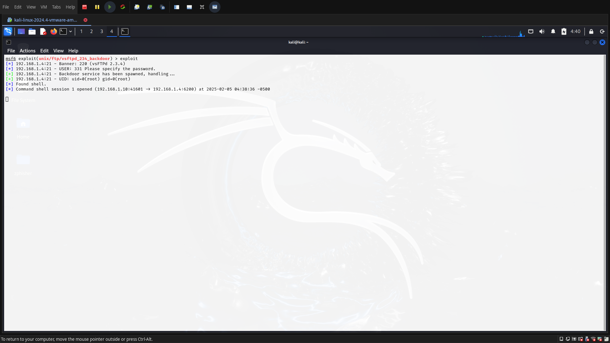

**Target:** Metasploitable 2 (vsftpd Service Exploitation)  
**Author:** Prayush Hada
**Date:** 2025-02-05

---

## **1. Introduction**

### **1.1 Objective**

Provide an overview of the penetration testing task, including the exploitation of the vsftpd service on Metasploitable 2.

### **1.2 Scope**

- Target machine: Metasploitable 2
- Service in focus: vsftpd (FTP Service)
- Tools used: nmap, Metasploit Framework, netdiscover

---

## **2. Methodology**

Explain the step-by-step approach taken during the penetration test.

### **2.1 Reconnaissance and Scanning**

- **Objective**: Scanning the network to discover the device's IP as Metasploitable is connected to the same network as the Kali machine.

- **Tool Used** : netdiscover, nmap

- **Command Snippet:

 - **Output:**

- Now that i have discovered the machine's IP, it's time to gather some information by scanning the IP address.

- For scanning I used the popular network scanning tool, Nmap.

- **Command Snippet:**

- **Output:**

- Now that I found that the `ftp vsftpd` port is open, I tried gaining access in the machine using a popular exploitation tool called Metasploit Framework.

### **2.2 Exploitation**

- **Objective:** Exploit the vsftpd vulnerability to gain unauthorized access
- **Tool Used:** Metasploit Framework
- **Commands Executed:**
	- **Accessing the metasploit framework:**
   
	

	- **Output:**
	
	
	
	- **Searching for vsftpd exploits:**
   
	

	- **Output:**
	
	
	
	
	- **Using the exploit**:
   
	
	 
	 - **Output:**
    
	
	
	- **Setting the target:**
   
	

	- **Output:**
   
	
	
	- **Exploiting the target:**
   
	

	- **Output:**
   
	

- Now that i got access to the root of the machine, I verified if i was really in it and ran the commands like `pwd` and `ls`.

- **Output:**
  

### 2.3 Post Exploitation

- **Objective:** Stabilizing shell, System Enumeration, Privilege escalation and establish persistence.

1. **Stabilizing the Shell:**
	- **Upgrading to an interactive shell for easier navigation.**:
		 - For gaining a interactive shell, i used a python library called pty, which emulates a physical terminal, preferrably a terminal emulator.
		
		- **Output:**
		

2. **System Enumeration:**
	- I gathered some vital information from the machine, since the issue of the machine is located at `/etc/issue` file, I used the `cat` command to check it and found the machine's Login credentials.
	
	- **Output:**
	
	
	- Then, i gathered some **User and Group Information**:
	
	- **Output:**
	

3. **Privilege Escalation using LinPEAS**:
	- I have root access on the Metasploitable shell. Despite this, I executed `linpeas.sh` to conduct a comprehensive post-exploitation enumeration and identify potential misconfigurations, weak services, or other vectors that could have facilitated privilege escalation or lateral movement.
	
	- **Finding potential binaries for privilege escalation:**
	
	- **Output:**
	
	 
	
	- **Automating Privilege Escalation using LinPEAS:**
		- **On Kali Linux:**
			
			- **Output:**
			
		- **On Metasploitable:**
		
		- **Output:**
		

	- **Executing `linpeas.sh`:**
	
	- **Output:**
	
	
	
	- **Key Findings:**
		- The following misconfigurations were identified despite already having root access:
		- The `/etc/passwd` file contained default user accounts that may be exploited in less secure environments.
		- SSH was running on port 22 with potential for brute-force attacks.
		- The system had writable scripts in `/usr/local/bin` that could facilitate persistence.

---

## **3. Conclusion**

The penetration testing exercise on Metasploitable 2 successfully demonstrated the exploitation of the vsftpd service. Post-exploitation activities, including system enumeration and privilege escalation checks, provided valuable insights into potential vulnerabilities and misconfigurations.

---

## **4. Recommendations**

1. **Service Hardening:** Update or disable the vsftpd service to prevent exploitation.
    
2. **User Account Review:** Remove or secure default user accounts.
    
3. **Secure SSH Configuration:** Restrict access and implement strong authentication mechanisms.
    
4. **System Monitoring:** Implement real-time monitoring for unauthorized access and privilege escalation attempts.
    

---

## References:

- Jacobs, J. (2023). _Exploiting vsftpd in Metasploitable 2_. Medium. Retrieved from [https://medium.com/@jasonjayjacobs/exploiting-vsftpd-in-metasploitable-2-cf975ead1173](https://medium.com/@jasonjayjacobs/exploiting-vsftpd-in-metasploitable-2-cf975ead1173)
    
- Syteca Blog (2024). _How escalating privileges can shake your enterprise security_. Retrieved from [https://www.syteca.com/en/blog/how-escalating-privileges-can-shake-your-enterprise-security](https://www.syteca.com/en/blog/how-escalating-privileges-can-shake-your-enterprise-security)
    
- ManageEngine (2024). _Privilege Escalation Attack: Security Threats and Prevention_. Retrieved from [https://www.manageengine.com/log-management/cyber-security/privilege-escalation-attack.html](https://www.manageengine.com/log-management/cyber-security/privilege-escalation-attack.html)
    
- GitHub PEASS-ng (2025). _Privilege Escalation Awesome Scripts Suite (PEASS)_. Retrieved from [https://github.com/peass-ng/PEASS-ng/tree/master/linPEAS](https://github.com/peass-ng/PEASS-ng/tree/master/linPEAS)
